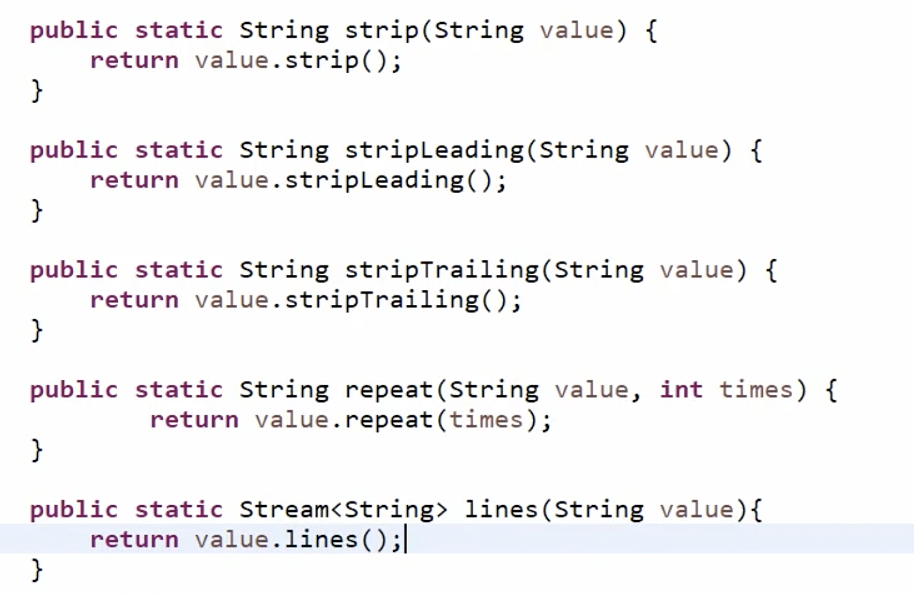

# Java API enhancements in 11,12 and 13

## Java 11

### String class

String.isBlank method

String.strip method - like trim but unicode aware

String.lines method

### File Handling

Simple one-liners to read and write files

### Lambda functions

Using the var keyword in lambda functions - useful if you want to annotate the arguments

### Simplified HttpClient

## Java 12

### String class

1) Indent method - adds whitespaces

2) Transform method - takes a function and transforms the string

### File

mismatch method - checks if two files are the same, or if it doesn't match

### Stream

Collectors.teeing

### Compact Number Format

## Java 13 (Preview Features)

### Multiline Strings

Multiline strings, stripIndent . translateEscapes and formatted

Formatted

## Java 14

### Record

Like a data class

### Show more information for NullPointerException

Add this flag

### Switch expressions

Adds cases to the same line, switch expressions, return values 

